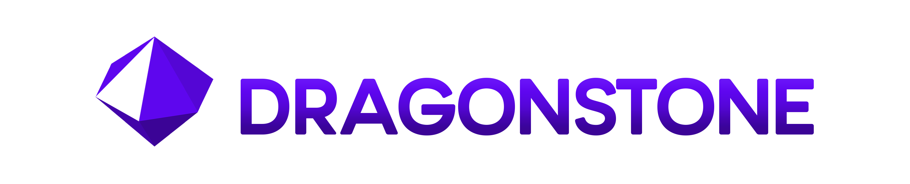

<p align="center">
    <div align="center">
        
    </div>
</p>

# <p align=center> Architecture Overview </p>

#### This document serves as a critical, living template designed to provide a quick, rapid and comprehensive understanding of the codebase's architecture. This document will update as the project evolves.

## 1. Project Structure

```md
[root]/
    ├── .git/                           
    ├── docs/                           -> documentation
    ├── examples/                       -> example .ds files
    ├── scripts/                        -> auto scripts
    ├── spec/                           -> testing files
    ├── tests/                          -> unimportant test .ds files
    ├── bin/
    │   ├── dragonstone                 -> main entry
    │   ├── dragonstone.ps1             -> .ps1 script for env
    │   └── dragonstone.bat             -> add to path and handoff to .ps1
    ├── src/
    │   ├── dragonstone/                -> main source
    │   ├── version.cr                  -> version control
    │   └── dragonstone.cr              -> orchestrator
    ├── shard.yml
    ├── package.forge                   -> (Coming Soon)
    ├── config.forge                    -> (Coming Soon)
    ├── LICENSE
    ├── FUNDING.yml
    ├── ROADMAP.md
    ├── ARCHITECTURE.md                 -> *you are here*
    ├── CONTRIBUTING.md
    ├── README.md
    ├── .editorconfig
    ├── .gitattributes
    └── .gitignore
```

## 2. Branding Information

### Media

#### Logo Information

The Dragonstone Logo is a hexagonal dipyramid. It consists of 12 triangular faces, 
with a hexagonal base at its center, has 18 edges and 8 vertices. The number
12 was chosen because it carries religious, mythological and magical symbolism. 
Many cultures around the world, for centuries have generally regarded the number 
as the representation of perfection, entirety, tranquility, or cosmic order.

One face is rendered as a contrasting/transparent triangle as an homage to 
Dragonstone’s early inspiration from the Crystal language. Each face is shaded 
with tones of the Dragonstone primary color scheme and that gradient is lightest 
at the top to darkest at the bottom, for dark it is reversed.

#### Name Information

A Dragonstone is a rare gemstone also known as Dragon Blood Jasper or Dragon's
Blood Stone, which is a mix of green epidote and red piemontite. It is used for 
its metaphysical properties to promote strength, courage, and a warrior's spirit, 
helping to overcome obstacles. The name also reflects the language’s goal: a 
gemlike language, with a compact syntax with the power to cut through complex 
systems.

#### Color Information

Although a Dragonstone is usually a mix of green and red, in some rare forms it can
have a purple tint, in addition to this its also a reference to the Dragonstone gem
found in the video game RuneScape, the source of my initial interest in ever becoming
a programmer, initially a Game Developer.

### Color

```css
    Dragonstone Primary Color:
        --DS-Primary:               oklch(0.4793 0.2774 285.03);        /* #5E06EE */

    Dragonstone Primary Color Gradient:
        --DS-Base-100:              oklch(0.5085 0.2825 287.47);        /* #6B15F9 */
        --DS-Base-200:              oklch(0.4793 0.2774 285.03);        /* #5E06EE */
        --DS-Base-300:              oklch(0.442 0.2547 285.27);         /* #5406D5 */
        --DS-Base-400:              oklch(0.3732 0.2141 285.73);        /* #4204A9 */
        --DS-Base-500:              oklch(0.3438 0.1956 286.38);        /* #3B0496 */
        --DS-Text-Accent:           oklch(0.4793 0.2774 285.03);        /* #5E06EE */

    Dragonstone Light Mode Alternate Color:
        --Light-Base:               oklch(0.9581 0 0);                  /* #F1F1F1 */
        --Light-Primary:            oklch(0.9157 0 0);                  /* #E3E3E3 */
        --Light-Secondary:          oklch(0.8767 0 0);                  /* #D6D6D6 */
        --Light-Accent:             oklch(0.8373 0 0);                  /* #C9C9C9 */
        --Text-Light-Primary:       var(--Dark-Secondary);
        --Text-Light-Secondary:     oklch(0.5192 0 0);                  /* #696969 */

    Dragonstone Dark Mode Alternate Color:
        --Dark-Base:                oklch(0.1638 0 0);                  /* #0E0E0E */
        --Dark-Primary:             oklch(0.2267 0 0);                  /* #1D1D1D */
        --Dark-Secondary:           oklch(0.2801 0 0);                  /* #292929 */
        --Dark-Accent:              oklch(0.3311 0 0);                  /* #363636 */
        --Text-Dark-Primary:        var(--Light-Secondary);
        --Text-Dark-Secondary:      oklch(0.6746 0 0);                  /* #969696 */

    Other Colors:
        --State-Positive            oklch(0.5842 0.1418 146.12);        /* #379144 */
        --State-Negative            oklch(0.9062 0.1927 105.48);        /* #BC002D */
        --State-Focus               oklch(0.5625 0.2405 270.2);         /* #455CFF */
        --State-Signal              oklch(0.5028 0.2021 20.72);         /* #F3E600 */
```
