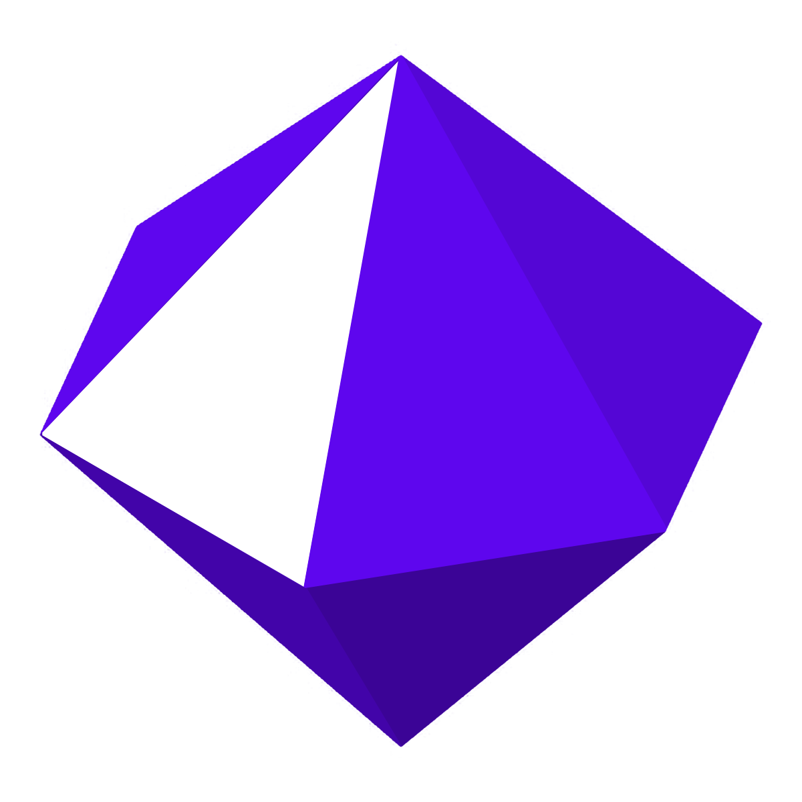

<p align="center">
    <div align="center">  </div>
</p>
<br>
<p align="center">
    <div align="center">
        
    </div>
    <br>
    <div align="center">
        
        
    </div>
    <div align="center">
        
    </div>
    <div align="center">
        
        
        
    </div>
</p>
<br>

##  What is Dragonstone?
Dragonstone is a general purpose, high-level, object-oriented programming language. It is both an interpreted and compiled language (*some compile targets are still a work in progress*), it's inspired by Ruby and Crystal but designed for programmer happiness, productivity, and choice.
<br>
<br>

## ⚙️ Project Setup
### *Requirements*
1. The [Crystal Programming Language](https://crystal-lang.org/install/) needs to be installed (*1.17.1+*).
2. (optional) [**LLVM/Clang**](https://releases.llvm.org/); While the [Crystal Programming Language](https://crystal-lang.org/install/) also installs [LLVM/Clang](https://releases.llvm.org/), installing a standalone version is recommended if you want to target `dragonstone build --target llvm`.
3. (optional) The [Ruby Programming Language](https://www.ruby-lang.org/en/downloads/) is needed if you want to use `dragonstone build --target ruby` (*3.4.6+*).

### *To Build from Source*
###### **(Linux/MacOS/Windows)**
1. Clone this repository.
2. `cd` to the project directory.
3. Run `shards build --release`

### *To Build from Source*
###### **(Windows Recommended)**
1. Clone this repository.
2. `cd` to the project directory.
3. Run `.\bin\dragonstone.bat --rebuild`
    - This builds with the icons/resources and adds `.\bin` to your user PATH Environmental Variables.
    - After running that command please restart your terminal, then you can use `dragonstone` from anywhere.

###### **(Windows Alternative)**
3. Run `shards build --release` for a standard build, without any icons/resources.

<br>

> **Tip:** Always use the `--release` flag for production builds as it significantly improves performance, without it a standard build is made and the dragonstone interpreter will run files about 3x slower.

> **Tip for Windows Users:** If you want to rebuild the project, after already doing so, you can use `.\bin\dragonstone.bat --clean` which will removed the build files, then you can use `.\bin\dragonstone.bat --rebuild` again.

> **Tip for Windows Users:** An installer is also available in the [Releases](https://github.com/Vallereya/dragonstone/releases) section.

## 🧪 Usage
#### Run Files via Interpreter. 
```bash
    # On PATH:
    dragonstone run examples/hello_world.ds

    # Not on PATH:
    ./bin/dragonstone.exe run examples/hello_world.ds
```

#### Select a Backend to Use.
###### For now this is a temporary flag so I can verify some of my --backend build targets as these are still being built out, this may change in the future when I start the self-host/bootstrap process.
```bash
    # Select between native (interpreter) or core (compiler) backends.
    dragonstone run --backend native examples/hello_world.ds
    dragonstone run --backend core examples/hello_world.ds

    # Without specifying it will automatically use the native (interpreter) or 
    # with auto it can choose the correct backend based on what is being ran 
    # within the file.
    dragonstone run examples/hello_world.ds
    dragonstone run --backend auto examples/hello_world.ds

    # However, if you don't want to specify the flag every time you can just 
    # set it change it anytime, this works on the fly.
    DRAGONSTONE_BACKEND=core dragonstone run examples/hello_world.ds

    # Or export the flag once, to set it permanently for the CI:
    export DRAGONSTONE_BACKEND=core
```

#### Build and Run Files via the Compiler with a target.
```bash
    # Supported Target Flags: bytecode, llvm, c, crystal, and ruby
    dragonstone build --target bytecode examples/hello_world.ds

    # Build and immediately execute the produced artifacts.
    dragonstone build-run --target bytecode examples/hello_world.ds
```

#### Run Test/Spec (still building out unit tests).
```bash
    # To run the full spec/unit testing suite.
    crystal spec

    # Helper script that runs the spec for just a specific backend.
    ./scripts/backend_ci.sh spec --backend native
    ./scripts/backend_ci.sh spec --backend core
```

## ✨ Examples
#### Example of a sting output using `echo`:
```crystal
    echo "Hello World!"
```

#### Example of comments/block comments using `#` and `#[ ]#`:
```nim
    # This is a Single Line Comment.

    #[
        This is a Multi-Line Comment.
    ]#

    message = "Hello!" # Trailing Comment.

    #[ Multi-Line Comment on same line. ]#     numbers = 10    #[ Inside or outside. ]#
```

#### Some Examples:
###### Example of a String.
```crystal
    name = "Ringo"

    echo name
```

###### Example of a `def` Method and String Interpolation.
```crystal
    def greet(name)
        echo "Hello, #{name}!"
    end

    greet("Jules")
```

###### Example of a `Class`.
```crystal
    class Person
        happy = true

        def greet
            if happy
                echo "Hello!"
            end
        end
    end

    person = Person.new
    person.greet
```

###### Also Ascii and Unicode are supported.
```crystal
    class 🔥
    あ = true
  
        def 道
            if あ
                echo "Hello!"
            end
        end
    end

    🔥.道
```

###### Example of a Module with `con`, an immutable constant, and `::` for scope resolution for modules.
```crystal
    module Grades
        con Score = 100

        class Greeting
            def greet
                "Hello! I got a #{Grades::Score}%!"
            end
        end
    end

    echo Grades::Score
    echo Grades::Greeting.greet
```

###### Example of a Map literal with key -> value pairs.
```crystal
    ages = { "Jules" -> 32, "Ringo" -> 29, "Peet" -> 35 }
    echo ages["Jules"]

    ages["Ringo"] = 30
    echo ages["Ringo"]

    ages.each do |name, age|
        echo "#{name} is #{age}"
    end

    e! ages.keys
    e! ages.values
```

#### Some More Examples but with Optional Types:
###### Example of a String with types.
```crystal
    name: str = "Peet"

    echo name
```

###### Example of some math/integers with types.
```crystal
    a: int = 10
    b: int = 10
    numbers = a + b

    echo numbers
```

###### Two examples of a `Class` with types, one of which showing Unicode support again.
```crystal
    def 😱(name: str) -> str
        echo "Hello, #{name}!"
    end

    😱("V")
```

###### With this example using a bit more complex features.
```crystal
    class Person
        property name: str

        def initialize(name: str)
            self.name = name
        end

        def greet
            echo "Hello, my name is #{self.name}"
        end
    end

    person = Person.new("Jules")
    person.greet
```

###### Two examples of `struct`.
```crystal
    struct Point
        property x: int
        property y: int

        def initialize(@x: int, @y: int)
        end
    end

    point = Point.new(10, 20)
    echo "x: #{point.x}, y: #{point.y}"
```

###### With this example showing `with`.
```crystal
    struct Point
        property x: int
        property y: int
    end

    point = Point.new(x: 1, y: 2)

    with point
        echo x
        echo y
    end
```

#### Example of using/importing other files with `use`.
###### From (./examples/use.ds)
```crystal
    use "test_use.ds"

    echo add(magic, 8)
```

###### What's being grabbed from (./examples/test_use.ds), and using the `con` keyword again.
```crystal
    con magic = 42

    def add(a, b)
        a + b
    end
```

###### Imports via `use` are built out, so you can import a file, selectively import as well, and the same applies by importing through a url.
###### **WARNING**: There is a current bug I made when I split the interpreter that I need to fix with imports, right now you need to specify `dragonstone run --backend native` and with the import specify the `.ds` when running a file with imports, but the `.ds` is not needed if importing something from the stdlib.
```crystal
    # Both by file and selectively using `from` with it.
    use "test_use.ds"
    use { Person } from "classes.ds"

    # Any both by file and selectively via a url, I used `cdn.jsdelivr.net`
    # because it was the only thing I could find that would grab the examples from GitHub.
    # I have also already started working on a dragonstone package manager, called `forge`,
    # so we can expect that soon as well. 
    use "https://cdn.jsdelivr.net/gh/vallereya/dragonstone@main/examples/unicode.ds"
    use { MyModule } from "https://cdn.jsdelivr.net/gh/vallereya/dragonstone@main/examples/resolution.ds"
```

#### Two examples of `para`, this is the Dragonstone version of what another languages calls a `Proc`.
###### For any `{}` used within Dragonstone, these can also be split between lines or placed on the same line.
```crystal
greet = ->(name: str) {
    "Hello, #{name}!" 
}

echo greet.call("Jalyn")
```

###### Another bit more complex `para`.
```crystal
square: para(int, int) = ->(x: int) { x * x }

echo square.call(6)
```

#### Examples the interop (some done but still a work in progress).
###### This calling convention will change when I expand the FFI.
```crystal
    # Call puts from Ruby
    ffi.call_ruby("puts", ["Hello from Ruby!"])

    # Call puts from Crystal
    ffi.call_crystal("puts", ["Hello from Crystal!"])

    # Call printf from C
    ffi.call_c("printf", ["Hello from C!"])
```

###### Like I said, the ffi is still a work in progress but I have settled on what it will look like, the only reason it doesn't work yet is because I'm still deciding on whether I want it as something from the stdlib by `use "ffi"` or through extending the actual ffi to support it, doing that would require a rewrite in some places that already all the current ffi.
```crystal
    #! This does not currently work but just to give you an ideal of where its going.
    Invoke C
        with printf

        as {
            "Hello from C!"
        }

    end
```

#### See the `examples/` directory for more sample `.ds` files.

## ⚡ Benchmark Information
- When using `--release` flag.
- <2% overhead at scale.
- Near identical for loops vs single.

You can run these yourself from the `./scripts` directory.

### *1 Billion Nested Loop Iteration Benchmark (Interpreter)*
```bash
    ~4.47   billion iterations/seconds
    ~224    ns

    Iterations:             4.47M/s
    Actual Time:            3.73 minutes
```

### *1 Billion Nested Loop Iteration Benchmark (LLVM Compiler)*
```bash
    ~812    billion iterations/seconds
    ~1.23   ns

    Iterations:             812M/s
    LLVM Compiler Time:     1.23 seconds
    Results:                ~182x Faster
```

### *Comparison Context*
###### For 1 billion iterations of this benchmark (Interpreter):
```bash
    Ruby v2.X.X         = ~15-30 minutes    (varies by version)
    Python v3.X.X       = ~5-15 minutes     (varies by version)
 -> Dragonstone         = ~3.7 minutes
    Lua                 = ~1-2 minutes
    JavaScript          = ~10-30 seconds    (using V8)
```

###### For 1 billion iterations of this benchmark (Compiler/LLVM):
```bash
    C                   = ~0.5-1.5 seconds
    Rust                = ~0.5-1.5 seconds
 -> Dragonstone LLVM    = ~1.23 seconds
    GO                  = ~1-2 seconds
    Java                = ~2-5 seconds      (using JIT)
    PyPy                = ~10-20 seconds    (using JIT)
    Node.js             = ~10-30 seconds    (using V8)
```

<!-- ## NOTE: Regarding `EDEN`
##### "Emergent Developmental Engine for Neural-Networks"
You may notice a placeholder folder/files for `EDEN`. Overall with the scope of this language `dragonstone` isn't going to be "just another general-purpose language", I'm keeping the future in mind with `EDEN` which for `dragonstone` will effectively be a domain optimized ecosystem for AI simulation. My choices via the backend specifically have a need for high performance compiled modules interacting with high level scripted logic.

Many successful languages are driven by some "Killer App" (Ruby had Rails, Rust had Servo, etc.) and `dragonstone` will have `EDEN`, at least from my end, what the community creates is another story.

From an architectural standpoint, my `hybrid` approach stems from that need to be able to run on the Core Compiler for raw speed, while the logic needs the Native Interpreter for self-modifying code and rapid behavior iteration. I plan to expose the simulation for controls directly to `dragonstone` through a native provider registry, allowing users to script scenarios or agent behaviors as easily as writing a web server.

Now, what is `EDEN`? Well, it's an AI development engine for developing AI inside a time-dilated virtual environment, learning embodied experience without dataset based pre-training. This is how we get to AGI.

`EDEN` has been a project of mine for several years, before LLMs and `dragonstone` with the current version of `dragonstone` within this repo is v5 that I actually started utilizing GitHub for and having worked on that I noticed that there is a need to be able to have some sort of full top to bottom approach to solve my issues there by allowing me to unify multiple languages and resources into a single language driver. `EDEN` currently sits in a private repo, but after I bootstrap the compiler, finish the ffi, and ship forge I will introduce the `EDEN` project and how with both of these, `dragonstone` is no longer just *"some language"* but can be used as the operating system for a synthetic world; anyways I digress.

## NOTE: Regarding AI-Assisted Development
LLM, hereafter "AI", code is not being using in the development of either of these projects (`EDEN` predates LLMs anyways), my use of AI is strictly via questions, code review, in some cases code completion, and with unit testing. Any code that *has* been generated by AI, I have tested, know how it works, and rewrote to fit my own standards and for the standards required for the scope of these projects. I bring this up because after reading about `EDEN` you may wonder about if AI has been used within these projects. -->

## 📝 Contact
    Project:
        www.github.com/vallereya

## ⚖️ License
*© 2025 Vallereya*
<br>
All rights reserved.
<br>

*Code and Contributions have **Apache-2.0 License** agreed upon by all copyright holders.
<br>
See **LICENSE** for more information.*
<br>
