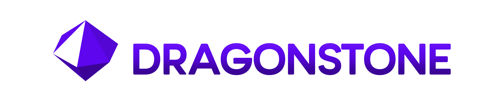

<p align="center">
    <div align="center">
        
    </div>
</p>

# <p align=center> Architecture Overview </p>
#### This document serves as a critical, living template designed to provide a quick, rapid and comprehensive understanding of the codebase's architecture. This document will update as the project evolves.

## 1. Project Versioning
### Version Layout 
This project will have a simple `xx.xx.xx` style versioning. For this we are going to be using a simple and common semantic versioning system. These will correspond to `Major.Minor.Patch`. 

#### Prototype Release Versioning
For the Prototype, `0.0.X` this versioning will be a little different due to needing to build the language first. Where `X` indicated a completed `Phase` on the ROADMAP.md, after the 10 initial phases are complete this project will enter `Pre-Alpha`.

#### Pre-Alpha Release Versioning
For Pre-Alpha, `0.1.0-4` this versioning will also be a little different as well due to needing to build essential features. Where the first `0-4` indicated a completed feature from a `Phase` on the ROADMAP.md. As such, 5 essential features are planned and then this project will enter `Alpha`.

#### Alpha Release Versioning
For Alpha, `0.1.5-9` this versioning will also be a little different as well due to needing to build extend those features, any major rewrites, and any additional features needed. Where the first `5-9` indicated a completed feature from a `Phase` on the ROADMAP.md, and then this project will enter `Beta`.

#### Beta Release Versioning
For Beta, `0.X.X` this versioning will where we start using the corresponding `Major.Minor.Patch`. Where the first `X` indicated a completed features from a `Phase` on the ROADMAP.md, and the second `X` will be for any fixes and patches that are needed to be shipped. The majority of this phase will be any fixes and performance improvements, before entering into the official `release`.

#### Release Versioning
For Release, `1.X.X` this versioning will where we be using the corresponding `Major.Minor.Patch`. And the language is in a place I feel is capable of a production environment. 

## 2. Project Structure

```md
[root]/
    ├── .github/
    │   ├── CONTRIBUTING.md
    │   └── FUNDING.yml
    ├── bootstrap/                      -> dragonstone bootstrap build
    ├── examples/                       -> example .ds files
    ├── scripts/                        -> auto scripts
    ├── log/                            -> log dump from some `spec` files.
    ├── spec/                           -> spec testing files
    ├── docs/                           -> documentation
    │   ├── 0. Index/                   -> project assets
    │   ├── 1. Getting Started/         -> language quickstart guides
    │   ├── 2. Introduction/            -> language features
    │   ├── 3. Specification/           -> basic language usage
    │   ├── 4. Advanced Specification/  -> advanced language usage
    │   ├── 5. Guides/                  -> misc. language guides
    │   ├── README.md                   -> documentation overview/table of contents
    │   ├── ARCHITECTURE.md         -> *you are here*
    │   └── ROADMAP.md                  -> project roadmap
    ├── bin/                            -> **BUILD**
    │   ├── payloads/                   -> 
    │   ├── dev/                        -> dev builds
    │   ├── build/                      -> dragonstone builds
    │   ├── resources/                  -> resources files needed for builds
    │   │   └── dragonstone.rc          -> icon resource file
    │   ├── dragonstone                 -> main entry
    │   ├── dragonstone.sh              -> .sh script for path, env and building (Linux and MacOS)
    │   ├── dragonstone.ps1             -> .ps1 script for env and building (Windows)
    │   └── dragonstone.bat             -> add to path and handoff to .ps1 (Windows)
    ├── src/                            -> **SOURCE**
    │   ├── dragonstone/
    │   │   ├── cli/                    -> command line interface
    │   │   ├── core/                   -> compiler + VM (frontend, IR, codegen, targets, runtime helpers)
    │   │   ├── hybrid/                 -> runtime engine, importer, backend cache/orchestration
    │   │   ├── native/                 -> interpreter runtime (env, evaluator, builtins, REPL)
    │   │   ├── shared/                 -> shared front-end + runtime commons
    │   │   ├── stdlib/                 -> dragonstone standard lib (`modules/{shared,native}` + data)
    │   │   ├── syslib/                 -> dragonstone system lib
    │   │   └── backend_mode.cr         -> backend flag/env helpers
    │   ├── version.cr                  -> version control
    │   └── dragonstone.cr              -> orchestrator
    ├── shard.yml
    ├── LICENSE
    ├── README.md
    ├── .editorconfig
    ├── .gitattributes
    └── .gitignore
```

## 3. Backend Architecture & Selection Flow
### Layer Overview
- **Shared front-end (`src/dragonstone/shared/*`)** # During and after Self-Hosting it will be located under `src/dragonstone/hybrid/shared/*`.
    - owns lexing, parsing, AST, semantic analysis, IR construction, and the runtime contracts (values/ABI/FFI) that both engines consume.
- **Native interpreter (`src/dragonstone/native/*`)**
    - evaluates IR/AST directly with the dynamic runtime. This is the compatibility floor and the REPL implementation.
- **Core compiler + VM (`src/dragonstone/core/*`)**
    - lowers IR to bytecode/targets via a dedicated frontend/IR/codegen pipeline and executes bytecode inside the VM runtime.
- **Hybrid orchestration (`src/dragonstone/hybrid/*`)** # During and after Self-Hosting it will be located under `src/dragonstone/hybrid/runtime/*`.
    - `Runtime::Engine` plus the importer/cache that decides which backend to use per module, exports namespaces, and persists compiled units, once bootstrap/self-host is completed this will be moved into the shared front-end and the hybrid section will be for embedded dragonstone.
- **Stdlib modules (`src/dragonstone/stdlib/modules/shared or native/*`)**
    - standard library and exposes metadata that declares backend requirements so the resolver can prevent incompatible mixes up front.
- **Syslib modules (`src/dragonstone/syslib/modules/*`)**
    - system libraries that extend the language natively.

### Backend Selection Flow
1. `Dragonstone::CLI` resolves a `BackendMode` from CLI flags or the `DRAGONSTONE_BACKEND` env var (`backend_mode.cr`).
2. `ModuleResolver` loads the entry file + dependencies, records `#! typed` directives, and caches stdlib data for backend compatibility.
3. `Runtime::Engine` constructs a candidate list:
   - Core VM is scheduled first when the IR is untyped, the AST is `IR::Lowering::Supports.vm?`, and stdlib data allows it.
   - Native interpreter is always added when no data forbids it and acts as the fallback path.
4. The engine iterates over candidates, using the importer to link dependencies; if a backend raises (unsupported feature, compilation failure, etc.) the next candidate executes transparently.
5. Successful units export their namespace back into the cache so subsequent modules (or the CLI smoke tests) see identical behavior regardless of backend.

## 4. Branding Information
### Media
#### Logo Information

The Dragonstone Logo is a hexagonal dipyramid. It consists of 12 triangular faces, 
with a hexagonal base at its center, has 18 edges and 8 vertices. The number
12 was chosen because it carries religious, mythological and magical symbolism. 
Many cultures around the world, for centuries have generally regarded the number 
as the representation of perfection, entirety, tranquility, or cosmic order.

One face is rendered as a contrasting/transparent triangle as an homage to 
Dragonstone’s early inspiration from the Crystal language. Each face is shaded 
with tones of the Dragonstone primary color scheme and that gradient is lightest 
at the top to darkest at the bottom, for dark it is reversed.

#### Name Information
A Dragonstone is a rare gemstone also known as Dragon Blood Jasper or Dragon's
Blood Stone, which is a mix of green epidote and red piemontite. It is used for 
its metaphysical properties to promote strength, courage, and a warrior's spirit, 
helping to overcome obstacles. The name also reflects the language’s goal: a 
gemlike language, with a compact syntax with the power to cut through complex 
systems.

#### Color Information
Although a Dragonstone is usually a mix of green and red, in some rare forms it can
have a purple tint, in addition to this its also a reference to the Dragonstone gem
found in the video game RuneScape, the source of my initial interest in ever becoming
a programmer, initially a Game Developer.

### Color

```css
    Dragonstone Primary Color:
        --DS-Primary:               oklch(0.442 0.2547 285.27);         /* #5406D5      RGB: 84, 6, 213     */

        --DS-Secondary-Lighter:     oklch(0.4793 0.2774 285.03);        /* #5E06EE      RGB: 94, 6, 238     */
        --DS-Secondary-Darker:      oklch(0.3732 0.2141 285.73);        /* #4204A9      RGB: 66, 4, 169     */

        --DS-Text-Accent:           oklch(0.442 0.2547 285.27);         /* #5406D5      RGB: 84, 6, 213     */

    Dragonstone Primary Color Gradient:
        --DS-Base-100:              oklch(0.5085 0.2825 287.47);        /* #6B15F9      RGB: 107, 21, 249   */
        --DS-Base-200:              oklch(0.4793 0.2774 285.03);        /* #5E06EE      RGB: 94, 6, 238     */
        --DS-Base-300:              oklch(0.442 0.2547 285.27);         /* #5406D5      RGB: 84, 6, 213     */
        --DS-Base-400:              oklch(0.3732 0.2141 285.73);        /* #4204A9      RGB: 66, 4, 169     */
        --DS-Base-500:              oklch(0.3438 0.1956 286.38);        /* #3B0496      RGB: 59, 4, 150     */

    Dragonstone Light Mode Alternate Color:
        --Light-Base:               oklch(0.9581 0 0);                  /* #F1F1F1      RGB: 241, 241, 241  */
        --Light-Primary:            oklch(0.9157 0 0);                  /* #E3E3E3      RGB: 227, 227, 227  */
        --Light-Secondary:          oklch(0.8767 0 0);                  /* #D6D6D6      RGB: 214, 214, 214  */
        --Light-Accent:             oklch(0.8373 0 0);                  /* #C9C9C9      RGB: 201, 201, 201  */
        --Text-Light-Primary:       var(--Dark-Secondary);
        --Text-Light-Secondary:     oklch(0.5192 0 0);                  /* #696969      RGB: 105, 105, 105  */

    Dragonstone Dark Mode Alternate Color:
        --Dark-Base:                oklch(0.1638 0 0);                  /* #0E0E0E      RGB: 14, 14, 14     */
        --Dark-Primary:             oklch(0.2267 0 0);                  /* #1D1D1D      RGB: 28, 28, 28     */
        --Dark-Secondary:           oklch(0.2801 0 0);                  /* #292929      RGB: 41, 41, 41     */
        --Dark-Accent:              oklch(0.3311 0 0);                  /* #363636      RGB: 54, 54, 54     */
        --Text-Dark-Primary:        var(--Light-Secondary);
        --Text-Dark-Secondary:      oklch(0.6746 0 0);                  /* #969696      RGB: 150, 150, 150  */

    Other Colors (maybe, might change):
        --State-Positive            oklch(0.5842 0.1418 146.12);        /* #379144      RGB: 55, 145, 68    */
        --State-Negative            oklch(0.5028 0.2021 20.72);         /* #BC002D      RGB: 188, 0, 45     */
        --State-Focus               oklch(0.5625 0.2405 270.2);         /* #455CFF      RGB: 69, 92, 255    */
        --State-Signal              oklch(0.9062 0.1927 105.48);        /* #F3E600      RGB: 243, 230, 0    */
```
